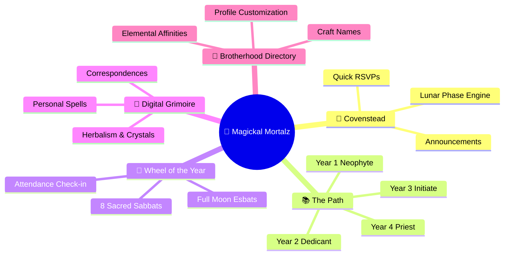
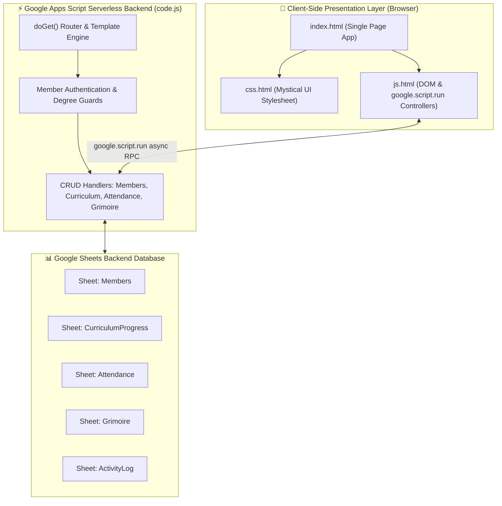

<!-- 🌙✨ MAGICKAL MORTALZ COVEN — REPOSITORY PRESENTATION (L3 SHOWCASE) -->

<div align="center">


# **🌙 Magickal Mortalz Coven**

**The official digital sanctuary and interactive member portal for the Magickal Mortalz Coven — a sacred brotherhood for gay Wiccans in South Florida.**

[](#-portal-features)
[-blue?style=flat-square)](#-tech-stack)
[](#-architecture--data-flow)
[](#-color-palette--aesthetics)
[](LICENSE)
[](https://img.shields.io/github/last-commit/traikdude/magickal-mortalz-coven)

<p align="center">
  <a href="#-overview"><b>Overview</b></a> •
  <a href="#-portal-features"><b>Features</b></a> •
  <a href="#-architecture--data-flow"><b>Architecture</b></a> •
  <a href="#-curriculum--degrees"><b>Curriculum</b></a> •
  <a href="#-wheel-of-the-year"><b>Wheel of the Year</b></a> •
  <a href="#-quick-start--development"><b>Quick Start</b></a> •
  <a href="#-deployment--clasp"><b>Deployment</b></a> •
  <a href="#-contributing"><b>Contributing</b></a> •
  <a href="#-license"><b>License</b></a>
</p>

</div>

---

## 📑 Table of Contents

- [✨ Overview](#-overview)
- [🔮 Portal Features](#-portal-features)
  - [🏰 1. Covenstead (Dashboard)](#1-covenstead-dashboard)
  - [📚 2. The Path (4-Year Wiccan Curriculum)](#2-the-path-4-year-wiccan-curriculum)
  - [🌙 3. Wheel of the Year (Sabbat & Esbat Tracking)](#3-wheel-of-the-year-sabbat--esbat-tracking)
  - [📖 4. Digital Grimoire & Spellbook](#4-digital-grimoire--spellbook)
  - [🏫 5. Online Campus & Study Circle](#5-online-campus--study-circle)
  - [👥 6. Circle of Mortalz (Member Profiles)](#6-circle-of-mortalz-member-profiles)
- [🏗️ Architecture & Data Flow](#-architecture--data-flow)
- [🎨 Color Palette & Aesthetics](#-color-palette--aesthetics)
- [🛠️ Tech Stack](#-tech-stack)
- [⚡ Quick Start & Development](#-quick-start--development)
- [🚀 Deployment & Clasp](#-deployment--clasp)
- [🗂️ Repository Structure](#-repository-structure)
- [🤝 Contributing](#-contributing)
- [📄 License](#-license)

---

## ✨ Overview

**Magickal Mortalz Coven** is an exclusive, full-featured web portal created for brothers of the Magickal Mortalz Coven in South Florida. It combines traditional Wiccan ritual structure with modern web engineering, providing members with a centralized digital space to track curriculum degrees, coordinate Sabbat gatherings, manage personal spellwork, and connect with fellow initiates.

Built on **Google Apps Script (V8 runtime)** and backed by reactive **Google Sheets databases**, the entire system runs serverlessly with zero hosting costs while delivering an app-like responsive experience.

---

## 🔮 Portal Features



### 1. Covenstead (Dashboard)
The central gathering hearth for initiates. Features live astrological/lunar phase calculations, upcoming gathering alerts, coven news, and quick-action modals for logging practice or submitting queries to the High Priest.

### 2. The Path (4-Year Wiccan Curriculum)
Structured progress tracking through the coven's traditional degree system:
* **Year 1 — Neophyte**: Foundations of the Craft, elemental magic, altar setup, and personal ethics.
* **Year 2 — Dedicant**: Deeper ritual construction, herbology, divination, and shadow work.
* **Year 3 — Initiate**: Advanced ceremonial magic, energy healing, and coven leadership.
* **Year 4 — Priest / High Priest**: Mastery of high ritual, coven governance, and ordination.

### 3. Wheel of the Year (Sabbat & Esbat Tracking)
Interactive countdown and attendance tracking for all 8 Solar Sabbats (*Samhain, Yule, Imbolc, Ostara, Beltane, Litha, Lughnasadh, Mabon*) and 13 Lunar Esbats with automatic RSVP registration.

### 4. Digital Grimoire & Spellbook
A secure, private personal grimoire allowing members to record rituals, spell outcomes, recipes, astrological timings, and correspondences with tag filtering and search.

### 5. Online Campus & Study Circle
Direct access to curated ritual PDF downloads, audio chants, lecture recordings, and historical Craft references.

### 6. Circle of Mortalz (Member Profiles)
Member directory displaying craft names, initiation dates, elemental affinities (*Earth, Air, Fire, Water, Spirit*), and contact preferences.

---

## 🏗️ Architecture & Data Flow



---

## 🎨 Color Palette & Aesthetics

The application implements the **Mystical UI v2.1 (Wiccan Night Palette)** design system:

| Swatch | Color Name | Hex Code | Purpose |
|:---:|---|---|---|
| 🟣 | **Deep Amethyst** | `#8B5CF6` | Primary accents, spiritual elements, active buttons |
| 🩵 | **Moonlit Cyan** | `#06B6D4` | Secondary highlights, water elemental, starlight glows |
| 🟡 | **Sacred Amber** | `#F59E0B` | Candlelight accents, fire elemental, notifications |
| 🌑 | **Midnight Indigo** | `#1E1B4B` | Background cards, container depth, shadows |
| 🌌 | **Deep Night Sky** | `#0F172A` | Global background canvas |
| ⚪ | **Moonlight White** | `#E2E8F0` | High-contrast body and header typography |

---

## 🛠️ Tech Stack

* **Platform**: Google Apps Script (V8 Engine)
* **Storage**: Google Sheets API (SpreadsheetApp service)
* **Frontend**: HTML5, CSS3 Variables, ES6+ JavaScript
* **Typography**: Google Fonts (*Cinzel*, *Philosopher*, *Poppins*)
* **Iconography**: FontAwesome 6 Pro (CDN)
* **Deployment Tooling**: `@google/clasp` (Command Line Apps Script Projects)

---

## ⚡ Quick Start & Development

### Prerequisites
* [Node.js](https://nodejs.org/) (v18+)
* Google Account with Apps Script API enabled
* Clasp CLI:
  ```bash
  npm install -g @google/clasp
  ```

### Local Setup
1. Clone this repository:
   ```bash
   git clone https://github.com/traikdude/magickal-mortalz-coven.git
   cd magickal-mortalz-coven
   ```
2. Log in to Google Apps Script via Clasp:
   ```bash
   clasp login
   ```
3. Link to your existing Apps Script project (or create a new one):
   ```bash
   clasp clone <YOUR_SCRIPT_ID>
   ```

---

## 🚀 Deployment & Clasp

Deploy modifications directly from your local terminal to the live Google Apps Script web application:

```bash
# Push local code changes to Google Apps Script
clasp push

# Pull any remote updates down to your repository
clasp pull

# Open the Apps Script editor in your default browser
clasp open
```

---

## 🗂️ Repository Structure

```text
magickal-mortalz-coven/
├── docs/                        # Presentation & visual assets
│   └── assets/
│       └── banner.png           # L3 Showcase high-resolution hero banner
├── appsscript.json              # Apps Script manifest, OAuth scopes & webapp config
├── code.js                      # Server-side controllers, Sheet models & RPC methods
├── css.html                     # Mystical UI stylesheet & CSS custom properties
├── index.html                   # Core single-page application structure & modals
├── js.html                      # Client-side state managers & RPC bridge handlers
├── README.md                    # L3 Showcase presentation documentation
├── .gitignore                   # Ignore .clasp.json credentials & node modules
└── ZEN-20251226-*_transcript.md # Historical development session transcripts
```

---

## 🤝 Contributing

1. Fork the repository and create a feature branch (`git checkout -b feature/sacred-enhancement`).
2. Test all Apps Script functions in a sandbox Google Sheet before pushing.
3. Commit with semantic commit messages (`feat(grimoire): add herb correspondence filter`).
4. Submit a Pull Request.

---

## 📄 License

Distributed under the **MIT License**. See [LICENSE](LICENSE) for details.

---

<div align="center">

*Blessed Be.*  
**Magickal Mortalz Coven · South Florida Brotherhood · Erik Gaton (Founder & High Priest)**

</div>
